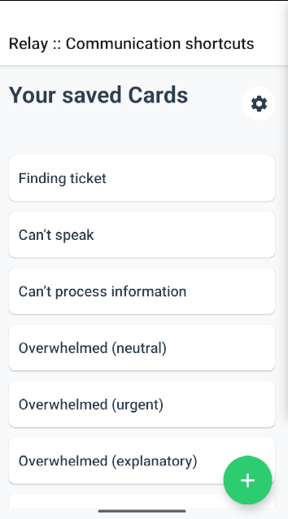
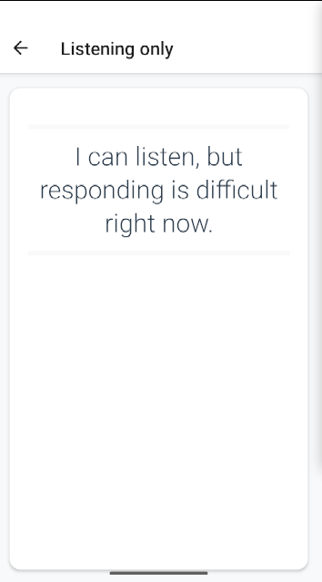

# Relay — Communication Shortcuts

> WIP - Work in Progress

> App is currently not finished

## Overview

Relay is a React Native application designed to reduce friction in non-verbal, high-stress or low-energy communication situations.

It provides pre-written, quickly accessible messages that can be shown instead of spoken, helping users navigate moments where verbal communication is difficult.

The project explores accessibility-first design, cognitive load reduction, and context-aware suggestion systems.

---

## Problem

In real-world interactions, there are situations where speaking is difficult or costly — for example due to:

- sensory overload
- fatigue or brain fog
- migraines or severe headaches
- temporary speech difficulty
- high-pressure public environments

Browsing, typing, or explaining repeatedly can increase stress.

Relay aims to minimize that friction by surfacing concise, ready-made messages with minimal interaction cost.

---

## Core Goals

- Replace verbal communication with pre-made cards
- Reduce cognitive load during high-stress moments
- Additional features planned:
  - Surface 1 primary + 2–3 fallback messages
  - Avoid scrolling for urgent use
  - Degrade gracefully when context confidence is low
  - Keep all inference fully on-device

---

## Current Features

- Template-based communication cards
- Custom card creation
- Local persistence using AsyncStorage
- Context scaffolding for future ranking logic
- Modular domain-driven folder structure

---

## Tech Stack

- React Native (Expo)
- TypeScript
- AsyncStorage now, secure (iOS Keychain/ Android Keystore) later
- File-based routing (Expo Router)

---

## Screenshots

 

## Project Structure

### Current Structure

```
Relay/
├── app/
│   ├── cards/
│   │   ├── [id].tsx
│   │   └── create.tsx
│   ├── _layout.tsx
│   ├── index.tsx
│   └── settings.tsx
├── components/
│   └── CardView.tsx
├── constants/
│   └── theme.ts
├── domain/
│   ├── accessibility/
│   │   └── AccessibilityContext.tsx
│   ├── bootstrap/
│   │   └── first-launch.ts
│   ├── card-sets/
│   │   ├── card-set.storage.ts
│   │   ├── card-set.templates.ts
│   │   └── CardSet.ts
│   ├── cards/
│   │   ├── Card.constants.ts
│   │   ├── Card.ts
│   │   ├── cards.initialization.ts
│   │   ├── cards.storage.ts
│   │   ├── cards.templates.ts
│   │   └── CardsContext.tsx
│   └── disclosures/
│       ├── disclosure.storage.ts
│       ├── disclosure.templates.ts
│       ├── Disclosure.ts
│       └── DisclosureContext.tsx
├── hooks/
│   └── useCards.ts
├── assets/
│   ├── images/
│   │   ├── android-icon-background.png
│   │   ├── android-icon-foreground.png
│   │   ├── android-icon-monochrome.png
│   │   ├── favicon.png
│   │   ├── icon.png
│   │   ├── logo.png
│   │   ├── splash-icon.png
│   │   └── splash.png
│   └── screenshots/
│       ├── screenshot-1.png
│       └── screenshot-2.png
├── ios/
├── android/
├── babel.config.js
├── package.json
└── README.md
```

### Domain-Driven Structure

The project follows a domain-driven design with clear separation:

```
- **app/** - Screens and navigation
- **components/** - Reusable UI components
- **domain/** - Business logic organized by domain
  - **cards/** - Card models, templates, storage, and context
  - **card-sets/** - Card set management
  - **disclosures/** - Disclosure models and storage
  - **accessibility/** - Accessibility features
  - **bootstrap/** - First-launch initialization
- **hooks/** - Custom React hooks
- **constants/** - Application constants and themes
- **assets/** - Images and other static assets
```

## Testing

### Test Structure

Planned test structure for Jest in this project:

```
**tests**/
├── domain/
│ ├── cards/
│ │ ├── Card.test.ts
│ │ ├── cards.storage.test.ts
│ │ ├── cards.templates.test.ts
│ │ └── CardsContext.test.tsx
│ ├── card-sets/
│ │ ├── CardSet.test.ts
│ │ └── card-set.storage.test.ts
│ └── disclosures/
│ ├── Disclosure.test.ts
│ └── disclosure.storage.test.ts
├── components/
│ └── CardView.test.tsx
├── hooks/
│ └── useCards.test.ts
├── bootstrap/
│ └── first-launch.test.ts
└── utils/
└── helpers.test.ts

```

### Running Tests

```bash
npm test
# or
npx jest
```

### Test Coverage

```bash
npx jest --coverage
```

## Running Locally

```bash
npm install
npx expo start
```
