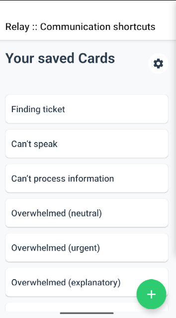
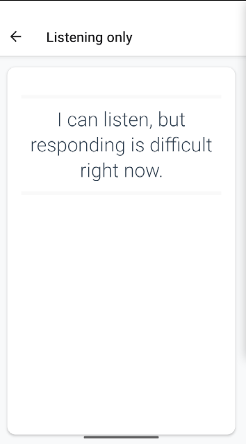

# Relay — Communication Shortcuts

> 🚧 Early prototype. APIs and features may change.
> Relay is currently focused on establishing the core card workflow and local persistence before expanding accessibility features.

## Overview

Relay is an offline-first React Native application designed to reduce friction in non-verbal, high-stress, or low-energy communication situations.

It provides pre-written, quickly accessible communication cards that can be shown instead of spoken, helping users navigate moments where verbal communication is difficult.

The project focuses on accessibility-first design and reducing cognitive load during difficult communication situations.

---

## Problem

In real-world interactions, there are situations where speaking is difficult or costly - for example due to:

- sensory overload
- fatigue or brain fog
- migraines or severe headaches
- temporary speech difficulty
- high-pressure public environments

Browsing, typing, or explaining repeatedly can increase stress.

Relay aims to minimize that friction by surfacing concise, ready-made messages with minimal interaction cost.

Relay is also intended to help when communicating with people who do not know sign language by providing reusable, easy-to-browse communication cards for common situations. The goal is to reduce friction rather than require repeated explanations.

Relay is intended for adolescents and adults and aims to avoid an infantilizing design.

---

## Current Features

- Template-based communication cards
- Create, edit, and delete custom cards
- Offline persistence using AsyncStorage
- Persistence error handling
- Modular domain-driven architecture

---

## Tech Stack

- React Native (Expo)
- TypeScript
- AsyncStorage (current local persistence)
- File-based routing (Expo Router)

---

## Screenshots

 

---

## Design Goals

- Reduce the amount of interaction required during stressful situations.
- Make frequently used messages available quickly.
- Support offline use.
- Respect user privacy through an offline-first approach.

---

## Status

### Current

- ✅ Card CRUD
- ✅ Local persistence
- ✅ Unit tests for card domain
- 🚧 Card sets
- 🚧 Disclosures
- 🚧 Settings

### Future Research

- Optional synchronization
- Import/export
- Shared card sets
- Translation support

## Running Locally

```bash
git clone <repository-url>
cd Relay
npm install
npx expo start
```

### Planned Features

- Lock screen shortcuts for frequently used cards (platform support permitting)

## Project Structure

### Current Structure

```
Relay/
├── app/
├── components/
├── domain/
│   ├── accessibility/
│   ├── bootstrap/
│   ├── cards/
│   ├── card-sets/
│   └── disclosures/
├── hooks/
├── __tests__/
├── assets/
└── docs/
```

### Domain-Driven Structure

The project follows a domain-driven design with clear separation:

- **app/** - Screens and navigation
- **components/** - Reusable UI components
- **domain/** - Business logic organized by domain
  - **cards/** - Card models, templates, storage, and context
  - **card-sets/** - Card set management
  - **disclosures/** - Disclosure models and storage
  - **accessibility/** - Accessibility features
  - **bootstrap/** - First-launch initialization
- **hooks/** - Custom React hooks
- **constants/** - Application constants and themes
- **assets/** - Images and other static assets

## Testing

### Test Structure

Current test structure for Jest mirrors app structure:

```
**tests**/
├── domain/
│ ├── cards/
│ │ ├── Card.test.ts
│ │ ├── cards.storage.test.ts
│ │ ├── cards.templates.test.ts
│ │ └── CardsContext.test.tsx
└── ...

```

### Running Tests

```bash
npm test
# or
npx jest
# or
npm run test:watch
# Run one specific file:
npx jest __tests__/domain/cards/Card.test.ts
# or
npm test -- Card.test.ts
```

### Test Coverage

```bash
npx jest --coverage
```

### Tests involving mocks for clearer test results

```bash
npm test -- --runInBand
```

## License

A project license has not been selected yet.
